# Z88 Recreate QMK Keyboard

The keyboard firmware is implemented using [QMK](https://qmk.fm/).

The implementation is not a particularly clean one, the authors of
this project not being QMK experts. A 64-key ANSI keyboard was taken
as the starting point, the info.json rearranged into an 8x8 grid to
match the hardware wiring, then the keymap arranged by a process of
trial and error until the pattern from the hardware matrix emerged.
Tricky keys like 'square' and 'diamond' were set to match the keys
chosen by the zesarux emulator.


## Hardware Setup

For the prototype keyboard, the hardware should be set up the same
as the keyboard test arrangement. See ../pico_test for details.

The SK6 connections go to the Pico's GP0 to GP7 pins via diodes.
These are active low outputs from the Pico. The diode's cathodes
are on the Pico side. I used 1N4148s because I had some.

The SK7 connections come back from the keyboard and go directly to
the Pico's GP8 to GP15 pins. Those are inputs to the Pico which
normally sit high. They are pulled low when the scan happens and
an appropriate key is pressed.

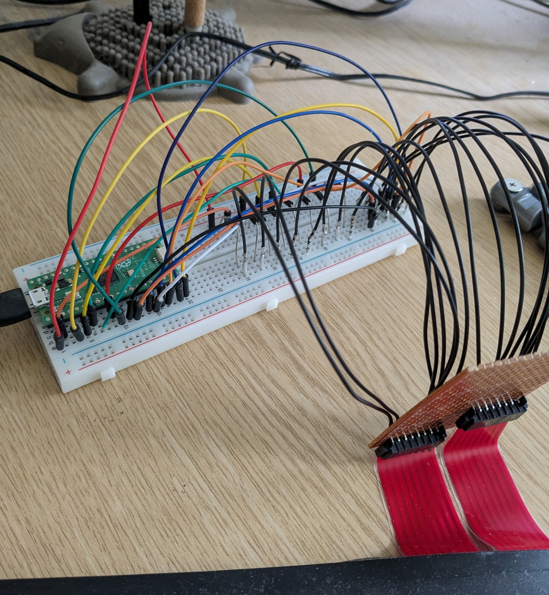

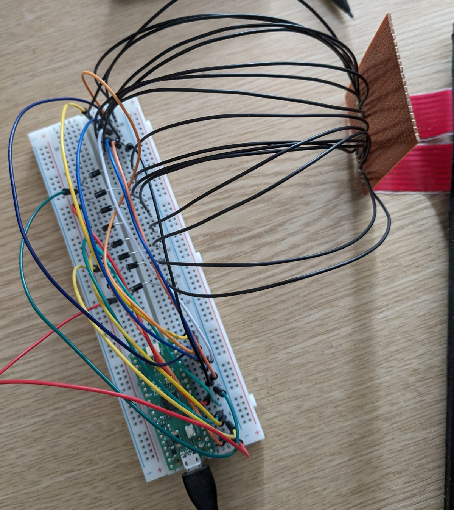

This (yellow) is the waveform from GPIO0 with no keys pressed:

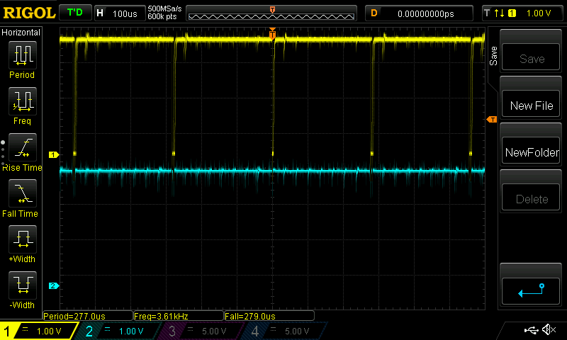

All the first 8 GPIOs show that pattern, QMK is pulling each of
the 8 lines low every 270microseconds or so.

This (blue) is the waveform on GPIO8, which is the return back
into the Pico from the keyboard, when I hold down one of the keys
on that line (I held key '1'):

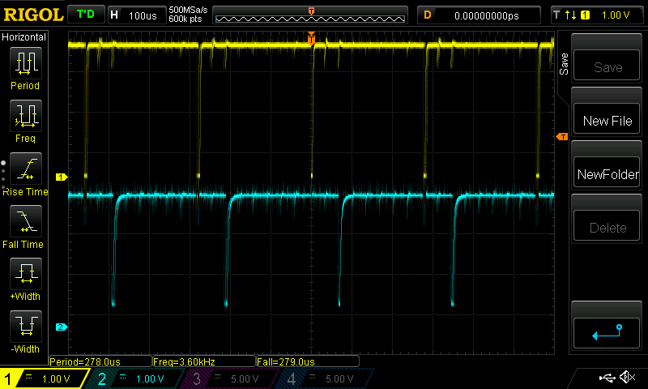

If I hold down a key from another line, I get a bit of leakage
of some sort:

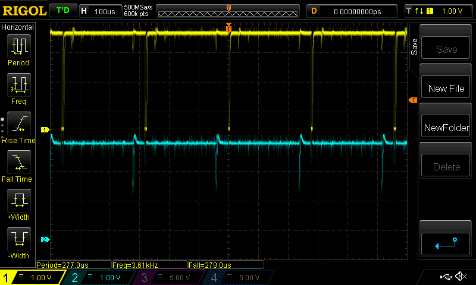

If I hold down all the keys in a row (ESC, TAB, 1, 2, 3, 4, 5
and 6 in this example) I see:

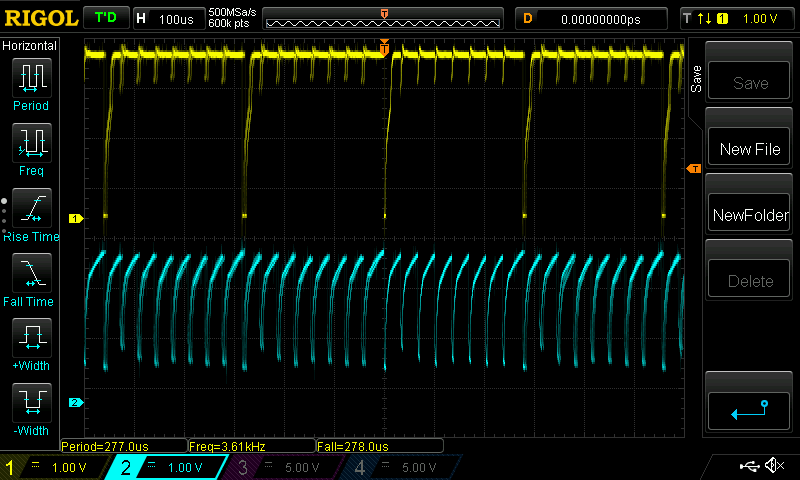

The hardware lines are a little jumbled, as per the matrix
diagram above. For example, the leftmost address line is on SK6
pin 2, not 1. So holding down ESC pulls down GPIO1 not GPIO0.
This is dealt with by the mapping in the keymap.c file, the
hardware should be wired sequentially to keep things simple.

## Double Shift Keys

Looking at some waveforms for the shift keys, which might be
of interest for the switch on/off feature.

With neither shift key pressed I see this waveform:

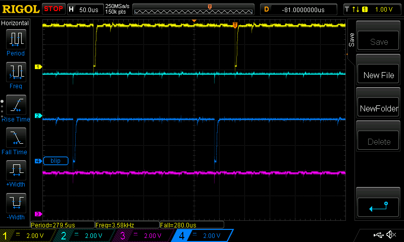

Yellow is GPIO0, which is the scanning output for A15. Dark blue
is connected to GPIO7 which appears to be the A8 connection, but
surely isn't? Not sure about that.

Holding down right shift gives this:

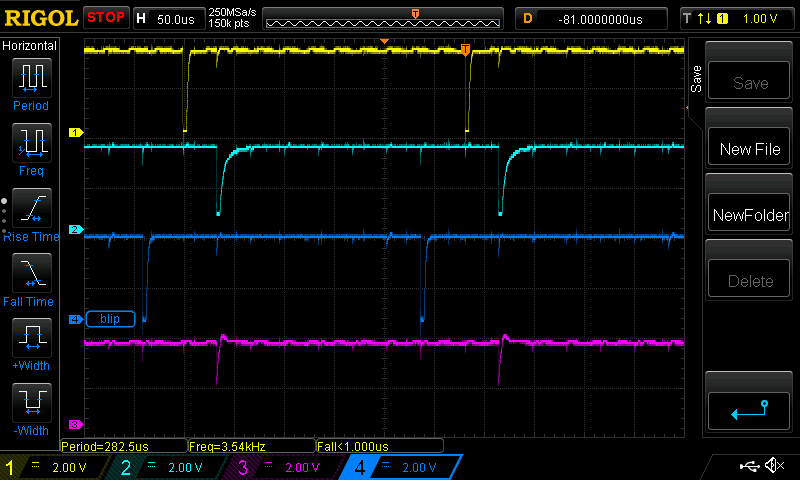

The response is on the cyan line, which is GPIO12.

Release right shift, then hold left shift:

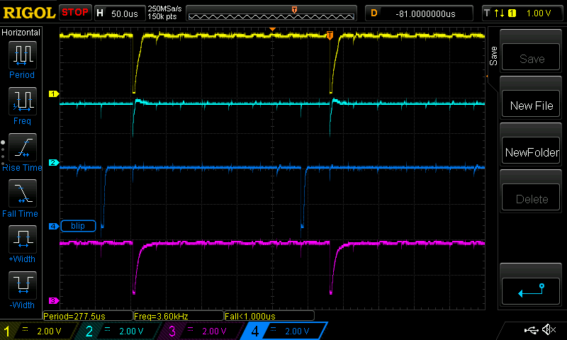

Response is on purple, which is GPIO14.

Holding both shifts:

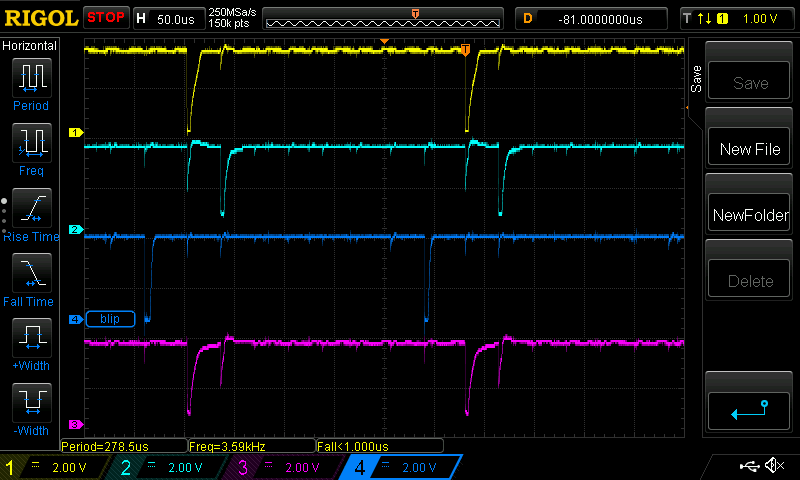

shows both key response signals and their faint stray signals.

Detail on both shifts:

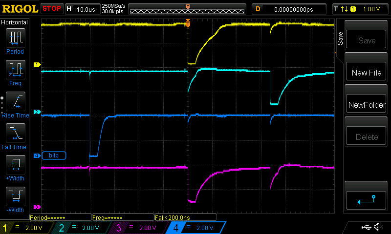

### Low power Pico keyboard

We've decided to do away with the idea of extra hardware to handle
the double shift key system and instead just use the Pico.

The Pico will sit dormant, woken every 100ms or so by a 555 timer.
When it wakes it'll check for the shift keys, then either go back
to sleep to kick everything off to turn it all on.

This all needs prototyping.

## UF2 File

There's a UF2 file alongside this README. Flash that to a Pico.

## Building

*The process of setting up QMK sets a bunch of hidden configuration files
such that it's hard to reinstall it from scratch without trashing a
working version. The following is from notes taken during the learning
process; it needs to be rewritten by someone who does the QMK setup
from scratch.*

Install QMK as described [here](https://docs.qmk.fm/#/newbs_getting_started).
You only really need the python PIP line and the "qmk setup" line.

Full details for the build are in the QMK [first build instructions](https://docs.qmk.fm/#/newbs_building_firmware).

Find the 'qmk_firmware/keyboards' directory and copy the 'z88r'
from this directory into it.

Set the keyboard you want to the z88 recreation one:

```
qmk config user.keyboard=z88r
```

Set your QMK username to whatever you want (I don't think it matters):

```
qmk config user.keymap=derekfountain
```

I *think* you need to do the new keymap step, but I'm not sure.  I
think that step sets things up for the compiler but overwrites the
default keymap.c file which you'll then have to refetch from this
repo. It's hard to tell, the QMK documentation was clearly written
by its developers.

The compile line is:

```
qmk compile -kb z88r -km default
```

